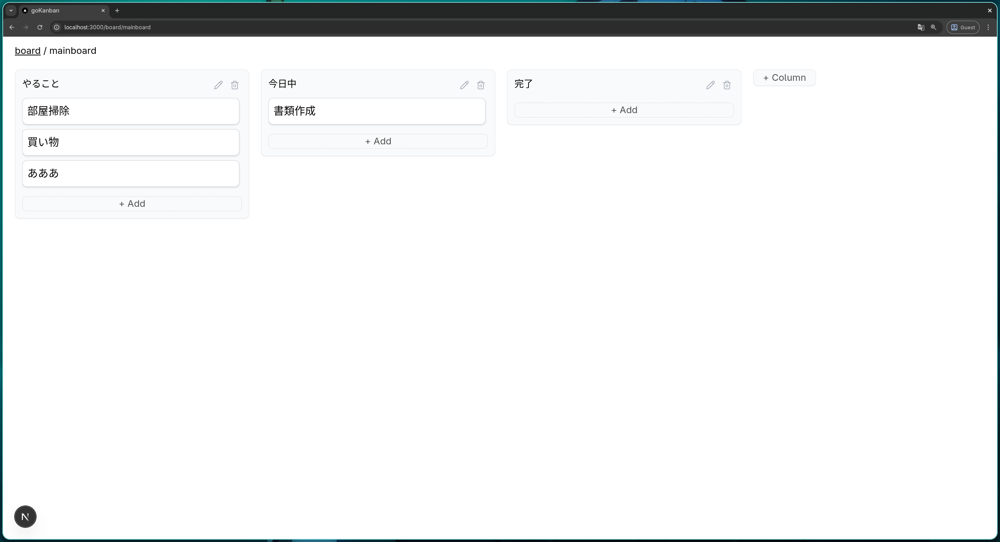

## simple-kanban

楽観的更新を用いたスムーズなカード操作が可能なかんばんwebアプリです。

### できていないこと

- レスポンシブ対応
- 複数端末やユーザーからの同時操作

### セットアップ

supabaseのプロジェクトを作成します。

supabaseの管理画面から、「Connect」→「Framework」→「Next.js」と選択し、表示されている `.env.local` のファイルをプロジェクトに追加してください。

[supabase.sql](./supabase.sql) をsupabase上のSQL Editorで手動で実行し、必要なテーブルを作成してください。
